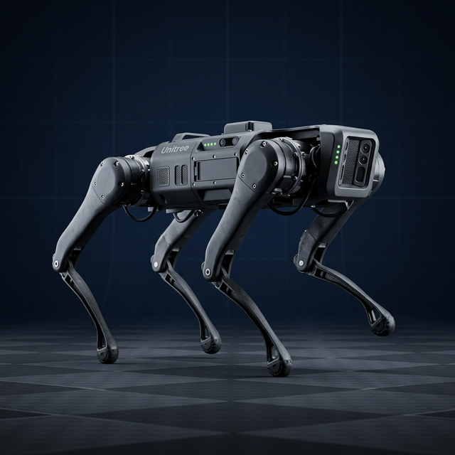

# 🤖 RobustWalker

**Blind Locomotion for Unitree Go1 using Deep Reinforcement Learning**

[](https://www.python.org/downloads/)
[](https://pytorch.org/)
[](https://mujoco.org/)
[](https://genesis-world.readthedocs.io/)
[](https://opensource.org/licenses/MIT)

---

## 📖 Overview

RobustWalker trains a **PPO-based neural network policy** to control the Unitree Go1 quadruped robot using **only proprioceptive sensing** (no cameras or LiDAR). The project supports both **MuJoCo** (CPU, single-env) and **Genesis** (GPU, massively parallel) simulators, enabling rapid policy iteration and comparison.

<p align="center">
  
</p>

### Key Features

- 🏃 **Blind Locomotion**: Walks using only joint encoders and IMU—no vision required
- ⚡ **Dual Simulator Support**: MuJoCo (CPU) and Genesis (GPU) with full comparison
- 🌍 **Domain Randomization**: Randomizes friction, payload, motor strength for sim-to-real transfer
- 🤸 **Trot Gait Control**: Diagonal symmetry reward produces natural quadruped locomotion
- 📊 **Comprehensive Metrics**: Side-by-side simulator comparison with training curves

---

## 📊 MuJoCo vs Genesis — Performance Comparison

### Training Metrics

| Metric | MuJoCo (SB3 PPO) | Genesis (rsl-rl PPO) |
|--------|:-----------------:|:--------------------:|
| **Total reward** | 30.83 ± 3.59 | **51.20** |
| **Episode length** | 11 steps (0.22s) | **1001 steps (20s)** |
| **Avg base height** | N/A (falls) | **0.333 m** |
| **Survival rate** | 0% (falls in <1s) | **100% (full episodes)** |
| **Best velocity** | 0.32 m/s | **1.41 m/s** (tracking) |
| **Push recovery** | 0% (0/5) | N/A (not tested yet) |

### Simulation & Training Speed

| Feature | MuJoCo | Genesis |
|---------|:------:|:-------:|
| **Backend** | CPU | GPU (CUDA) |
| **Physics rate** | 500 Hz | 100 Hz (2 substeps) |
| **Control frequency** | 50 Hz | 50 Hz |
| **Parallel environments** | 4–16 | **4096** |
| **Training throughput** | ~2K steps/s | **169K steps/s** |
| **Speedup** | 1× (baseline) | **~85×** |
| **Time to 147M steps** | ~20 hours | **~14 minutes** |
| **Eval FPS (headless)** | ~50 | **~556** |

### Reward Architecture Comparison

| Reward Component | MuJoCo | Genesis | Notes |
|-----------------|:------:|:-------:|-------|
| Velocity tracking | ✅ exp(-err/σ) | ✅ exp(-err/σ) | Both use Gaussian |
| Alive bonus | ✅ 0.1/step | ✅ 1.0/step | Genesis uses larger bonus |
| Base height | ✅ exp(-err/σ) | ✅ squared error | Different formulations |
| Torque penalty | ✅ sum(τ²) | ✅ sum(τ²) | Identical |
| Action rate | ✅ sum(Δa²) | ✅ sum(Δa²) | Identical |
| Joint acceleration | ✅ sum(Δv²) | ✅ sum(Δv²) | Identical |
| Orientation | ✅ gravity proj | ✅ gravity proj | Identical |
| Foot contact | ✅ force sensors | ❌ unavailable | Genesis limitation |
| **Trot symmetry** | ❌ | ✅ **diagonal pairs** | Compensates for no contact |
| **Hip penalty** | ❌ | ✅ **dedicated** | Prevents leg splaying |
| Stumble detection | ✅ geom contact | ✅ height-based | Different methods |
| Joint limits | ✅ squared | ❌ | Not yet in Genesis |
| Termination | ✅ -5.0 | ✅ roll/pitch check | Different approaches |

### Key Architectural Differences

| Aspect | MuJoCo | Genesis |
|--------|--------|---------|
| **RL Framework** | Stable-Baselines3 | rsl-rl |
| **Algorithm** | PPO (MlpPolicy) | PPO (ActorCritic) |
| **Network** | [256, 256] | [512, 256, 128] |
| **Observations** | 57-dim (with history) | 45-dim (no history) |
| **Contact detection** | Force sensors per foot | Calf link Z-height |
| **Domain randomization** | ✅ friction, mass, push | ❌ (not yet) |

---

## 🏗️ Architecture

### Policy Network

```
┌─────────────────────────────────────────────────────────────┐
│                    Observation (45-dim)                       │
├─────────────────────────────────────────────────────────────┤
│  Ang Vel (3) │ Proj Gravity (3) │ Commands (3)              │
│  Joint Pos (12) │ Joint Vel (12) │ Last Action (12)         │
└───────────────────────────┬─────────────────────────────────┘
                            ▼
┌─────────────────────────────────────────────────────────────┐
│              MLP [512, 256, 128] + ELU                       │
└───────────────────────────┬─────────────────────────────────┘
                            ▼
┌─────────────────────────────────────────────────────────────┐
│                 Joint Position Targets (12)                   │
│              (PD Controller → Torques → Robot)               │
└─────────────────────────────────────────────────────────────┘
```

### Action Space (12 dimensions)

Joint position targets for all 12 actuators:
- **FR** (Front Right): hip, thigh, calf
- **FL** (Front Left): hip, thigh, calf  
- **RR** (Rear Right): hip, thigh, calf
- **RL** (Rear Left): hip, thigh, calf

---

## 🎯 Genesis Reward Function (v10)

The reward function balances locomotion, posture enforcement, and gait quality:

```python
reward = tracking_lin_vel + tracking_ang_vel + alive
       - symmetry - hip_deviation - similar_to_default
       - base_height - orientation - stumble
       - action_rate - dof_acc - torque - ang_vel_xy - lin_vel_z
```

| Component | Weight | Description |
|-----------|--------|-------------|
| **Velocity tracking** | 1.5 / 0.8 | Forward + yaw tracking (Gaussian) |
| **Alive bonus** | 1.0 | Reward per survived timestep |
| **Trot symmetry** | -2.0 | Diagonal pair matching (FR↔RL, FL↔RR) |
| **Hip deviation** | -1.0 | Prevents leg splaying |
| **Similar to default** | -0.1 | Keeps joints near standing pose |
| **Base height** | -30.0 | Maintain 0.34m standing height |
| **Orientation** | -5.0 | Penalizes roll/pitch |
| **Stumble** | -5.0 | Penalizes body dragging ground |
| **Action rate** | -0.03 | Smooth actions (anti-jitter) |
| **DOF acceleration** | -3.5e-7 | Smooth joint trajectories |
| **Torque** | -0.0002 | Energy efficiency |

---

## 🔀 Domain Randomization (MuJoCo)

| Parameter | Range | Applied When |
|-----------|-------|--------------| 
| **Ground Friction** | [0.5, 1.2] | Per episode |
| **Payload Mass** | [0, 4] kg | Per episode |
| **Motor Strength** | [0.9, 1.1]× | Per episode |
| **External Pushes** | [0, 15] N | Every 5-10 seconds |

---

## 📁 Project Structure

```
ROBUSTWALKER/
├── assets/go1/              # MuJoCo/Genesis model files (MJCF)
│   ├── go1.xml              # Robot definition
│   └── scene.xml            # Scene with ground plane & lighting
├── robustwalker/            # Core Python package
│   ├── envs/
│   │   ├── go1_env.py       # MuJoCo Gymnasium environment
│   │   ├── genesis_env.py   # Genesis GPU-parallel environment
│   │   └── domain_rand.py   # Domain randomization
│   ├── rewards/
│   │   └── locomotion.py    # Multi-objective reward function
│   └── utils/
│       ├── mujoco_utils.py  # MuJoCo helper functions
│       └── genesis_utils.py # Genesis tensor math helpers
├── scripts/
│   ├── train.py             # PPO training (MuJoCo + SB3)
│   ├── evaluate.py          # Policy evaluation (MuJoCo)
│   ├── visualize.py         # Render trained policy (MuJoCo)
│   ├── genesis_train.py     # PPO training (Genesis + rsl-rl)
│   ├── genesis_eval.py      # Policy evaluation (Genesis)
│   └── record_genesis_gif.py # Record trotting GIF
├── configs/
│   ├── default.yaml         # MuJoCo hyperparameters
│   └── genesis.yaml         # Genesis hyperparameters (v10)
└── tests/
    └── test_env.py          # Environment unit tests
```

---

## 🚀 Quick Start

### Installation

```bash
# Clone repository
git clone https://github.com/shrirag10/ROBUSTWALKER.git
cd ROBUSTWALKER

# Create virtual environment (recommended)
python -m venv venv
source venv/bin/activate

# Install dependencies
pip install -r requirements.txt
```

### MuJoCo Training (CPU)

```bash
# Train with default config (~2M steps)
python scripts/train.py

# Custom training
python scripts/train.py --timesteps 5000000 --n-envs 16

# Evaluate
python scripts/evaluate.py --checkpoint logs/best_model.zip
```

### Genesis Training (GPU — Recommended)

```bash
# Install Genesis dependencies
pip install genesis-world rsl-rl-lib==2.2.4

# Train with 4096 parallel environments (~14 min)
python scripts/genesis_train.py -e go1-walking -B 4096 --max_iterations 1500

# Fine-tune from existing checkpoint
python scripts/genesis_train.py -e go1-v2 -B 4096 --max_iterations 500 \
    --resume logs/go1-walking/model_1400.pt

# Evaluate with interactive viewer
python scripts/genesis_eval.py -e go1-walking --ckpt 1400

# Headless evaluation (no display needed)
python scripts/genesis_eval.py -e go1-walking --ckpt 1400 --headless --steps 1000
```

---

## 📈 Training Progress

### Genesis Training Curve (v10)

The v10 policy was trained using a **curriculum approach**:

1. **Phase 1 (v8)**: Trained from scratch with L-R symmetry → learned to stand and walk (+41 reward)
2. **Phase 2 (v10)**: Fine-tuned with diagonal trot symmetry → learned proper trot gait (+51 reward)

| Phase | Iterations | Reward | Episode Length | Key Reward |
|-------|-----------|--------|----------------|------------|
| v8 (from scratch) | 1500 | +41.22 | 1001 (full) | L-R symmetry -0.039 |
| v10 (fine-tune) | +500 | **+51.20** | 1001 (full) | Trot symmetry -0.056 |

Monitor training with TensorBoard:

```bash
tensorboard --logdir logs/
```

---

## ⚙️ Configuration

### Genesis Config (`configs/genesis.yaml`)

```yaml
env:
  action_scale: 0.25          # Action scaling factor
  kp: 50.0                    # PD proportional gain
  kd: 1.0                     # PD derivative gain
  episode_length_s: 20.0      # Episode length in seconds

reward:
  reward_scales:
    tracking_lin_vel: 1.5      # Forward velocity reward
    symmetry: -2.0             # Diagonal trot symmetry
    hip_deviation: -1.0        # Prevent leg splaying
    action_rate: -0.03         # Smooth actions

training:
  num_envs: 4096              # Parallel environments
  max_iterations: 1500        # Training iterations
```

---

## 🔬 Technical Details

### Trot Gait Symmetry

The key innovation enabling natural quadruped locomotion in Genesis is the **diagonal trot symmetry** reward:

```
Trot Pattern:
  Phase 1: FR↗ + RL↗ (diagonal pair 1 swings)
           FL↘ + RR↘ (diagonal pair 2 contacts)

  Phase 2: FL↗ + RR↗ (diagonal pair 2 swings)
           FR↘ + RL↘ (diagonal pair 1 contacts)
```

This is implemented by penalizing the difference between diagonal pairs:
- `loss = |FR_joints - RL_joints|² + |FL_joints - RR_joints|²`

> **Note:** Simple left-right symmetry (FR=FL, RR=RL) prevents walking entirely—it locks left and right legs to identical positions, allowing only vibration-based forward motion.

### PPO Hyperparameters (Genesis)

| Parameter | Value |
|-----------|-------|
| Rollout steps/env | 24 |
| Minibatch count | 4 |
| Epochs per update | 5 |
| Discount (γ) | 0.99 |
| GAE (λ) | 0.95 |
| Clip range | 0.2 |
| Entropy coefficient | 0.01 |
| Learning rate | 0.001 (adaptive) |

---

## 📚 References

- [Proximal Policy Optimization (PPO)](https://arxiv.org/abs/1707.06347) - Schulman et al., 2017
- [Learning to Walk in Minutes](https://arxiv.org/abs/2109.11978) - Rudin et al., 2022
- [Genesis: GPU-accelerated Simulation](https://genesis-world.readthedocs.io/)
- [Unitree Go1 Documentation](https://www.unitree.com/products/go1)
- [MuJoCo Physics Engine](https://mujoco.org/)

---

## 📄 License

MIT License - see [LICENSE](LICENSE) for details.

---

## 👤 Author

**Srinivasan Shriram**  
[GitHub](https://github.com/shrirag10)
